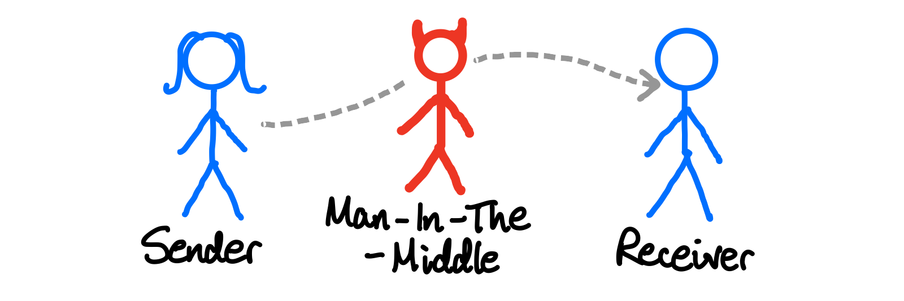
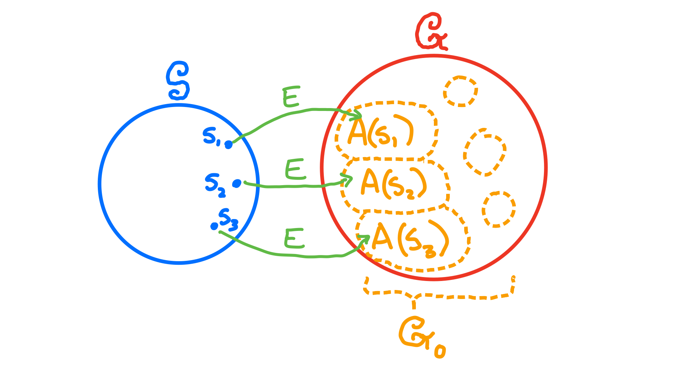

# Algebraic Manipulation Detection Codes

The vague real world scenario that we are imagining here is one where someone sends a message, and before it reaches the receiver, it is intercepted by a nefarious man in the middle.

Now, there's a whole massive deal about ways we can stop the  adversary 😈 *reading* the message; but what we want to focus right now is how to tell if they *changed* the message. It may well be encrypted, but they could still change some of the bits by adding or subtracting: *manipulating* it *algebraically.* This might just result in gobbledaygook, buttt... it's actually possible that they manipulate the message in smart ways to get information out of the receiver.

We need a way of encoding a message, even an encrypted message, to make a [tag](https://en.wikipedia.org/wiki/Message_authentication_code), a kind of seal of approval that won't look right if message has been tampered with. Ergo: an Algebraic Manipulation Detection code: AMD code.

## How do we formulate these mathematically?

We're not gonna get into any specifics of message authentication tags or how these things might actually work in practice. Instead we're going to try and find a way to talk about AMD codes abstractly and mathematically.

The first thing to do is to define a set with a curly $\mathcal S$ that represents *all* the possible messages we might want to make tags for. These might be encrypted or unencrypted; English, Japanese; Morse code, hieroglyphs, it doesn't matter: it's just a set. We'll call it the **source space**. Let's say that there are $m$ possible messages in this source space, so $|\mathcal S| = m$.

Then we'll have a set curly $\mathcal G$ that represents all the possible tags, called the **encoded message space**. Unlike the source space, these are the things that might get manipulated algebraically, so we'll probably assume that $\mathcal G$ is a set where that kind of stuff is possible: i.e. we'll say $\mathcal G$ is an [abelian group](https://en.wikipedia.org/wiki/Abelian_group)! We'll say that there are $n$ possible tags, so $|\mathcal G| = n$.

Now, for each message in $\mathcal S$, we'll have a subset of $\mathcal G$ which are the *valid* encodings for that message. If we have a particular message $s$, we'll write this as $A(s) \subseteq \mathcal G$. It's not going to be very useful if the same code is valid for two different messages, so each of the $A(s)$ sets mustn't overlap:  $A(s)∩A(s') = \varnothing$ if $s \neq s'$. We might of course have some invalid, (but possible) encodings, so we'll call the set of valid encodings for all the messages  $\mathcal G_0 = \bigcup\limits_{s \in \mathcal S} A(s)$. Let's define the sizes: $|A(s)| = a_s$ and $|\mathcal G_0| = a$.

NB: If we just want to talk about the set of all the $A(s)$ sets, rather than the union of all the elements, we'll call that curly $\mathcal A = \{ A(s) : s \in \mathcal S \}$.

Finally we need our actual encoding function! This needs to be some sort of function $E : \mathcal S \to \mathcal G$ that maps each $s$ in $\mathcal S$ to some $g$ in the corresponding $A(s)$. The function might be randomised. We'll figure out more about later.

For the moment, it seems that all this enough to completely described our AMD code. So we write an AMD code formally by defining the tuple $(\mathcal S, \mathcal G, \mathcal A, E)$.

## Playing the game of AMD Codes

How do we think about this business of an adversary interfering when we're defining everything in terms of maths? We imagine we're playing a game 😁. Depending on how we define the rules of this game, we can have either what's called *strong* security or *weak* security.

### How to play: The Weak AMD Code Game 🏓

This is for two players: basically the idea is for an adversary to try to manipulate an encoded value so that it is still valid, despite being changed.

The encoder 😇 makes their AMD code $(\mathcal S, \mathcal G, \mathcal A, E)$

1. The adversary 😈 chooses some non-zero value $\Delta$ in $\mathcal G$ according to a *strategy*. This is the value they are going to use to manipulate things! For convenience we'll denote their strategy for choosing the value $\sigma$, but it can be any strategy, including a random one.
2. The encoder 😇 picks a source $s$ from $\mathcal S$: we'll assume they just do this completely at random.
3. The encoder 😇 encodes their source by computing $E(s) = g$, which will be something in $A(s)$.
4. The adversary  😈 adds their $\Delta$ value to the encoded source $g$, so they now have a value $g + \Delta$. If $g + \Delta$ is a valid tag for some other value in $\mathcal S$, i.e. if $g + \Delta \in A(s')$ for some $s' \neq s$ then the adversary 😈 wins! 😱😱😱

This is "weak" because the encoder has the advantage of picking their source *after* the the adversary has chosen $\Delta$ - the adversary doesn't know what it might be and so can't take it into account in their strategy.

### How to play: The Strong AMD Code Game 🏋️‍♂️

The hardcore version of the game is basically the same, but we swap steps 1 and 2. This means that the source is determined first, and the adversary gets to know what it is. They then don't need to incorporate any source probabilities into their strategy - they can tailor it exactly!

In both versions, we call the probability of any particular strategy $\sigma$ succeeding $\epsilon_\sigma$ and the probability of the *best* possible strategy succeeding $\hat \epsilon = \max \limits_\sigma\{\epsilon_\sigma\}$.

Not being on the side of the devil, we obviously want to make AMD codes that make this $\hat \epsilon$ *as small as possible*. It's important enough that we categorise our AMD codes by the sizes of $\mathcal S$ and $\mathcal G$ along with this $\hat \epsilon$. So we'll take about **strong $(m, n, \hat \epsilon)$-AMD codes**, and **weak $(m, n, \hat \epsilon)$-AMD codes**.

...

What does all this have to do with Generalised Strong External Difference Families? More to come!

