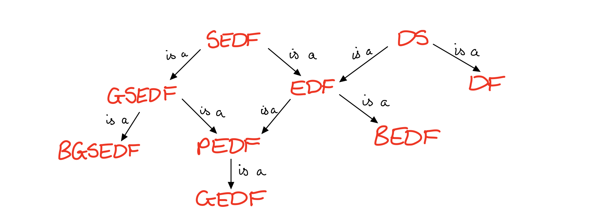

# More variations on External Differences Families

We've had *differences sets*, *difference families*, *external difference families*, *strong external difference families* and *generalised strong external difference families*...

...now it's time for just a few more!  😇

## Bounded External Difference Families

What if, rather than saying that the external differences have to make up the non-zero elements of our group *exactly* $\lambda$ times, what if we just say that it has to make them up *no more than* $\lambda$ times?

We have to formulate that slightly differently, saying for every $g$ in $G\backslash\{e\}$, the following must hold:
$$
|\{xy^{-1}\}: xy^{-1} = g, x \in A_i, y \in A_j, i \neq j \}| \leq \lambda
$$

## Generalised External Difference Families

Okay we had Generalised Strong External Difference Families, so it's fairly reasonable to guess we might be able to have the *generalised* without the *strong*.

Basically the only difference here is that we allow all of the sets to be different size: so $|A_i| = k_i$, and then the same old condition needs to hold:
$$
M = \{xy^{-1} : x \in A_i, y \in A_j, i \neq j\} = \lambda(G\backslash\{e\})
$$
We can call this a $(n, m , k_1, \dots, k_m, \lambda)$-GEDF, or also a *perfect difference system of sets*.

## Bounded Generalised Strong External Difference Family

Just when you thought we couldn't squeeze in any more words! Take the condition for the generalised strong external difference family, and make it no more than $\lambda$ times rather than exactly $\lambda$ times.

Again we have to write this a bit differently. We have $m$ $A$s with $|A_i| = k_i$ and $m$ $\lambda$s. We then require for each $1 \leq i \leq m$ that for every $1 \leq j \leq m$ and every $g \in G \backslash \{e \}$ :
$$
|\{xy^{-1}\}: xy^{-1} = g, x \in A_i, y \in A_j, i \neq j \}| \leq \lambda
$$
This is also called a *differential structure* (or at least it's equivalent, anyway).

## Partitioned External Difference Family

Last one! (for now)

We can let the sets all be different sizes in a slightly different way. Let's group them together: saying for example that we have 3 sets of size 1, 4 of size 2, 2 of size 3 etc.

We then want the condition to hold for each grouping, and we'll let it be different $\lambda$s for each group.

We''ll call the size groupings $c_1, \dots, c_l$ and the count for each size $k_1, \dots, k_l$, (so we have $k_h$ sets of size $c_h$) We then have $m = \sum_i c_i$ sets in total  and we'll require that for every $h$ from $1$ up to $l$:
$$
M_h = \bigcup_{i: |A_i| = c_h} \{xy^{-1} : x \in A_i, y \in \cup_{j \neq i}A_j\} = \lambda_h(G\backslash\{e\})
$$

## Relationships Between the Structures

- An $(n, m, \lambda)$-difference set is an $(n, 1, m, \lambda)$-difference family.
- An $(n, m, \lambda)$-difference set is an $(n, m, 1, \lambda)$-external difference family
- An $(n, m, k, \lambda)$-external difference family is an $(n, m, k, \lambda)$-bounded external difference family.
- An $(n, m, k, \lambda)$-external difference family is an $(n, m;m;k; \lambda)$-partitioned external difference family.
- An $(n, m, k, \lambda)$-strong external difference family is an $(n, m, k, m\lambda)$-external difference family.
- An $(n, m, k, \lambda)$-strong external difference family is an $(n, m; k, \dots, k; \lambda, \dots, \lambda)$- generalised strong external difference family.
- An $(n, m; k_1, \dots, k_m; \lambda_1, \dots, \lambda_m)$-generalised strong external difference family is an $(n, m; k_1, \dots, k_m; \lambda_1, \dots, \lambda_m)$-bounded generalised strong external difference family.
- An $(n, m; k_1, \dots, k_m; \lambda_1, \dots, \lambda_m)$-generalised strong external difference family is an $(n, m; 1, \dots, 1; k_1, \dots, k_m; \lambda_1, \dots, \lambda_m)$ partitioned external difference family.
- An $(n, m; c_1, \dots, c_l; k_1, \dots, k_l, \lambda_1, \dots, \lambda_l)$ partitioned external difference family is an $(n, m; k_1^{c_1},\dots, k_l^{c_l}; \sum \limits_{i=1}^l \lambda_i)$-generalised external difference family.

...

(tweetle beetle puddle paddle battle)

Hopefully that's the end of the torrent of definitions for the moment. I'll try to look into some results and examples next!

